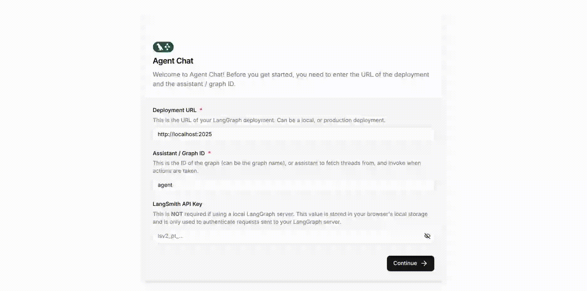

# POC: LangGraph Chat

This is a Proof of Concept (PoC) of https://github.com/langchain-ai/agent-chat-ui

## Overview

The main idea is to setup an agent-chat-ui instance that makes calls to a LangGraph agent.
To achieve this, we have a simple backend agent based on https://github.com/langchain-ai/oap-langgraph-tools-agent. 
This agent only supports OpenAI LLMs, but it can be extended to support other LLMs and tools.

## Demo

Check out LangGraph Chat in action:



## Getting Started

### Prerequisites

- Node.js 18+ and pnpm (for frontend)
- Python 3.10+ (for backend agent)
- Docker and Docker Compose (for containerized deployment)

### How to Run

1. **Clone the repository**

```bash
git clone https://github.com/yourusername/langgraph-chat.git
cd langgraph-chat
```

2. **Complete the credential setup**

Create a `.env` file  based on `.env.example` with your OpenAI API key:
```
OPENAI_API_KEY=your_openai_api_key
```

3. **Run**

```bash
docker-compose up -d
```

4. **Test**

Open http://localhost:3001 in your browser

## Contributing

Contributions are welcome! Please feel free to submit a Pull Request.

1. Fork the repository
2. Create your feature branch (`git checkout -b feature/amazing-feature`)
3. Commit your changes (`git commit -m 'Add some amazing feature'`)
4. Push to the branch (`git push origin feature/amazing-feature`)
5. Open a Pull Request

## License

This project is licensed under the MIT License - see the LICENSE file for details.
